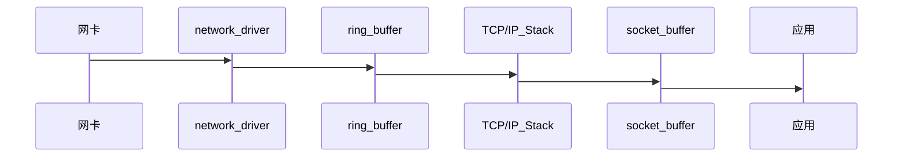

## Linux服务器丢包故障如何定位与解决
> 我们使用Linux作为服务器操作系统时，为了达到高并发处理能力，充分利用机器性能，经常会进行一些内核参数的调整优化，但不合理的调整
>也常常会引起意向不到的其他问题，本文就一次Linux服务器丢包故障的处理过程，结合Linux内核参数说明和TCP/IP协议栈相关的理论，介绍
>一些常见的丢包故障定位方法和解决思路。

在开始之前，我们先用一张图解释linux系统接收网络报文的过程。


```
1.首先网络报文通过物理网线发送到网卡
2.网络驱动程序会把网卡中的报文读取出来放到ring buffer中，这个过程使用DMA(Direct Memory Access),不需要CPU参与
3.内核从ring buffer 中读取报文进行处理，执行IP和TCP/UDP层的逻辑，最后把报文放到应用程序的socket buffer中
4.应用程序从socket buffer中读取报文进行处理
```

在接收UDP报文的过程中，上面任何一个过程都可能会主动或者被动地把报文丢弃，因此丢包可能发生在网卡和驱动，也可能发生在系统和应用。
之所以没有分析发送数据流程，一是因为发送流程和接收流程类似，只是方向相反；另外发送流程报文丢失的概率比接收小，只有在应用程序发送
的报文速率大于内核和网卡处理速率时才会发生。

本文假定机器只有一个名字为eth0的interface,如果有多个interface或者interface的名字不是eth0,则按照实际情况进行分析。

`NOTE`: 文中出现的`RX`(receive)表示接收报文，`TX`(transmit)表示发送报文。

### 名词解释

```
ifconfig eth0

eth0: flags=4163<UP,BROADCAST,RUNNING,MULTICAST>  mtu 1500
        inet 10.111.160.47  netmask 255.255.255.0  broadcast 10.111.160.255
        ether 00:16:3e:0e:a9:7e  txqueuelen 1000  (Ethernet)
        RX packets 58618562257  bytes 7552909229876 (6.8 TiB)
        RX errors 0  dropped 1628  overruns 0  frame 0
        TX packets 48682082491  bytes 6337921515906 (5.7 TiB)
        TX errors 0  dropped 0 overruns 0  carrier 0  collisions 0

- RX errors: 表示总的收包的错误数量，包括too-long-frames错误，Ring Buffer 溢出错误，crc 校验错误，帧同步错误, fifo overruns以及
missed pkg 等等。

- RX dropped: 表示数据包已经进入了 Ring Buffer,但是由于内存不够等系统原因，导致在拷贝到内存的过程中被丢弃。

- RX overruns: 表示了fifo的overruns,这是由于 Ring Buffer(aka Driver Queue传输的IO 大于kernel(内核) 能够处理的IO导致的，而 Ring Buffer
则是指在发起IRQ 请求之前的那块buffer,很明显，overruns的增大意味着数据包没到Ring Buffer就被网卡物理层给丢弃了，而CPU无法及时的处理中断是造成Ring
Buffer满的原因之一。

- RX frame: 表示 misaligned(错位)的frames。

对于 TX 的来说，出现上述 counter 增大的原因主要包括 aborted transmission(中止传输), errors due to carrirer(运营商造成的错误), fifo error, 
heartbeat erros(心跳错误) 以及 windown error，而 collisions(碰撞) 则表示由于 CSMA/CD 造成的传输中断。

dropped与overruns的区别 dropped，表示这个数据包已经进入到网卡的接收缓存fifo队列，并且开始被系统中断处理准备进行数据包拷贝（从网卡缓存fifo队列拷贝到系统内存），
但由于此时的系统原因（比如内存不够等）导致这个数据包被丢掉，即这个数据包被Linux系统丢掉。 overruns，表示这个数据包还没有被进入到网卡的接收缓存fifo队列就被丢掉，
因此此时网卡的fifo是满的。为什么fifo会是满的？因为系统繁忙，来不及响应网卡中断，导致网卡里的数据包没有及时的拷贝到系统内存，fifo是满的就导致后面的数据包进不来，
即这个数据包被网卡硬件丢掉。所以，个人觉得遇到overruns非0，需要检测cpu负载与cpu中断情况。
```

### 排查过程

服务器能正常接收到数据包，问题可以限定在两种可能：部分客户端发出的数据包本身异常；服务器处理部分客户端的数据包时触发了某种机制丢弃了数据包。

#### 有哪些情况会导致Linux服务器丢弃数据包

##### 确认是否有UDP丢包发生

要查看网卡是否有丢包，可以使用 ethtool -S eth0 查看，在输出中查找 bad 或者 drop 对应的字段是否有数据，在正常情况下，这些字段对应的数字应该都是 0。如果看到对应的数字在不断增长，就说明网卡有丢包。

另外一个查看网卡丢包数据的命令是 ifconfig，它的输出中会有 RX(receive 接收报文)和 TX（transmit 发送报文）的统计数据：
```
$ ifconfig eth0
...
        RX packets 58618562257  bytes 7552909229876 (6.8 TiB)
        RX errors 0  dropped 1628  overruns 0  frame 0
        TX packets 48682082491  bytes 6337921515906 (5.7 TiB)
        TX errors 0  dropped 0 overruns 0  carrier 0  collisions 0
...
```

此外，linux 系统也提供了各个网络协议的丢包信息，可以使用 netstat -s 命令查看，加上 –udp 可以只看 UDP 相关的报文数据：
```
$ netstat -s -u

IcmpMsg:
    InType0: 190
    InType3: 266243826
    InType4: 411
    InType8: 6495201
    InType11: 10894618
    InType13: 166
    OutType0: 6495201
    OutType3: 221112
    OutType8: 4
    OutType14: 165
Udp:
    2990011252 packets received
    294281 packets to unknown port received.
    12065163 packet receive errors
    2445613860 packets sent
    11349104 receive buffer errors
    0 send buffer errors
    InCsumErrors: 716059
UdpLite:
IpExt:
    InNoRoutes: 5
    InOctets: 8497427371979
    OutOctets: 7430483451841
    InNoECTPkts: 72925103725
    InECT1Pkts: 772364
    InECT0Pkts: 626693
    InCEPkts: 346395
```

对于上面的输出，关注下面的信息来查看UDP丢包的情况:

```
- packet receive errors 不为空，并且在一直增长说明系统有 UDP 丢包

- packets to unknown port received 表示系统接收到的 UDP 报文所在的目标端口没有应用在监听，一般是服务没有启动导致的，并不会造成严重的问题

- receive buffer errors 表示因为 UDP 的接收缓存太小导致丢包的数量
```

***并不是丢包数量不为零就有问题，对于 UDP 来说，如果有少量的丢包很可能是预期的行为，比如丢包率（丢包数量/接收报文数量）在万分之一甚至更低。***

##### 网卡或者驱动丢包

如果 `ethtool -S eth0` 中有 rx_***_errors 那么很可能是网卡有问题，导致系统丢包，需要联系服务器或者网卡供应商进行处理。

```
$ ethtool -S eth0 | grep rx_ | grep errors
     rx_crc_errors: 0
     rx_missed_errors: 0
     rx_long_length_errors: 0
     rx_short_length_errors: 0
     rx_align_errors: 0
     rx_errors: 0
     rx_length_errors: 0
     rx_over_errors: 0
     rx_frame_errors: 0
     rx_fifo_errors: 0
```

`netstat -i` 也会提供每个网卡的接发报文以及丢包的情况，正常情况下输出中 error 或者 drop 应该为 0

```
$ netstat -i 

Kernel Interface table
Iface      MTU    RX-OK RX-ERR RX-DRP RX-OVR    TX-OK TX-ERR TX-DRP TX-OVR Flg
docker0   1500        0      0      0 0             0      0      0      0 BMU
eth0      1500 58625605699      0   1628 0      48687797077      0      0      0 BMRU
lo       65536 14307872948      0      0 0      14307872948      0      0      0 LRU
```

如果硬件或者驱动没有问题，一般网卡丢包是因为设置的缓存区（ring buffer）太小，可以使用 ethtool 命令查看和设置网卡的 ring buffer。
`ethtool -g` 可以查看某个网卡的 ring buffer

```
$ ethtool -g eth0

Ring parameters for eth0:
Pre-set maximums:
RX:		256
RX Mini:	0
RX Jumbo:	0
TX:		256
Current hardware settings:
RX:		256
RX Mini:	0
RX Jumbo:	0
TX:		256
```

Pre-set 表示网卡最大的 ring buffer 值，可以使用 `ethtool -G eth0 rx 8192` 设置它的值。

