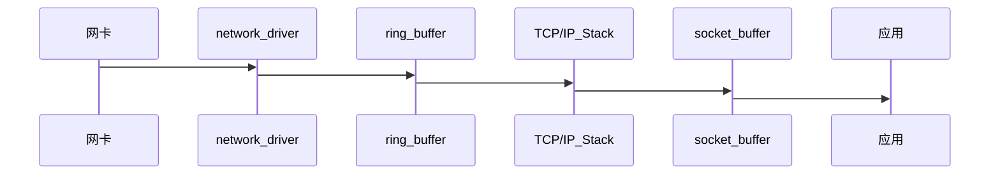

## Linux服务器丢包故障如何定位与解决
> 我们使用Linux作为服务器操作系统时，为了达到高并发处理能力，充分利用机器性能，经常会进行一些内核参数的调整优化，但不合理的调整
>也常常会引起意向不到的其他问题，本文就一次Linux服务器丢包故障的处理过程，结合Linux内核参数说明和TCP/IP协议栈相关的理论，介绍
>一些常见的丢包故障定位方法和解决思路。

在开始之前，我们先用一张图解释linux系统接收网络报文的过程。


```
1.首先网络报文通过物理网线发送到网卡
2.网络驱动程序会把网卡中的报文读取出来放到ring buffer中，这个过程使用DMA(Direct Memory Access),不需要CPU参与
3.内核从ring buffer 中读取报文进行处理，执行IP和TCP/UDP层的逻辑，最后把报文放到应用程序的socket buffer中
4.应用程序从socket buffer中读取报文进行处理
```

在接收UDP报文的过程中，上面任何一个过程都可能会主动或者被动地把报文丢弃，因此丢包可能发生在网卡和驱动，也可能发生在系统和应用。
之所以没有分析发送数据流程，一是因为发送流程和接收流程类似，只是方向相反；另外发送流程报文丢失的概率比接收小，只有在应用程序发送
的报文速率大于内核和网卡处理速率时才会发生。

本文假定机器只有一个名字为eth0的interface,如果有多个interface或者interface的名字不是eth0,则按照实际情况进行分析。

`NOTE`: 文中出现的`RX`(receive)表示接收报文，`TX`(transmit)表示发送报文。

### 名词解释

```
ifconfig eth0

eth0: flags=4163<UP,BROADCAST,RUNNING,MULTICAST>  mtu 1500
        inet 10.111.160.47  netmask 255.255.255.0  broadcast 10.111.160.255
        ether 00:16:3e:0e:a9:7e  txqueuelen 1000  (Ethernet)
        RX packets 58618562257  bytes 7552909229876 (6.8 TiB)
        RX errors 0  dropped 1628  overruns 0  frame 0
        TX packets 48682082491  bytes 6337921515906 (5.7 TiB)
        TX errors 0  dropped 0 overruns 0  carrier 0  collisions 0

- RX errors: 表示总的收包的错误数量，包括too-long-frames错误，Ring Buffer 溢出错误，crc 校验错误，帧同步错误, fifo overruns以及
missed pkg 等等。

- RX dropped: 表示数据包已经进入了 Ring Buffer,但是由于内存不够等系统原因，导致在拷贝到内存的过程中被丢弃。

- RX overruns: 表示了fifo的overruns,这是由于 Ring Buffer(aka Driver Queue传输的IO 大于kernel(内核) 能够处理的IO导致的，而 Ring Buffer
则是指在发起IRQ 请求之前的那块buffer,很明显，overruns的增大意味着数据包没到Ring Buffer就被网卡物理层给丢弃了，而CPU无法及时的处理中断是造成Ring
Buffer满的原因之一。

- RX frame: 表示 misaligned(错位)的frames。

对于 TX 的来说，出现上述 counter 增大的原因主要包括 aborted transmission(中止传输), errors due to carrirer(运营商造成的错误), fifo error, 
heartbeat erros(心跳错误) 以及 windown error，而 collisions(碰撞) 则表示由于 CSMA/CD 造成的传输中断。

dropped与overruns的区别 dropped，表示这个数据包已经进入到网卡的接收缓存fifo队列，并且开始被系统中断处理准备进行数据包拷贝（从网卡缓存fifo队列拷贝到系统内存），
但由于此时的系统原因（比如内存不够等）导致这个数据包被丢掉，即这个数据包被Linux系统丢掉。 overruns，表示这个数据包还没有被进入到网卡的接收缓存fifo队列就被丢掉，
因此此时网卡的fifo是满的。为什么fifo会是满的？因为系统繁忙，来不及响应网卡中断，导致网卡里的数据包没有及时的拷贝到系统内存，fifo是满的就导致后面的数据包进不来，
即这个数据包被网卡硬件丢掉。所以，个人觉得遇到overruns非0，需要检测cpu负载与cpu中断情况。
```

### 排查过程

服务器能正常接收到数据包，问题可以限定在两种可能：部分客户端发出的数据包本身异常；服务器处理部分客户端的数据包时触发了某种机制丢弃了数据包。

#### 有哪些情况会导致Linux服务器丢弃数据包

##### 1.确认是否有UDP丢包发生

要查看网卡是否有丢包，可以使用 ethtool -S eth0 查看，在输出中查找 bad 或者 drop 对应的字段是否有数据，在正常情况下，这些字段对应的数字应该都是 0。如果看到对应的数字在不断增长，就说明网卡有丢包。

另外一个查看网卡丢包数据的命令是 ifconfig，它的输出中会有 RX(receive 接收报文)和 TX（transmit 发送报文）的统计数据：
```
$ ifconfig eth0
...
        RX packets 58618562257  bytes 7552909229876 (6.8 TiB)
        RX errors 0  dropped 1628  overruns 0  frame 0
        TX packets 48682082491  bytes 6337921515906 (5.7 TiB)
        TX errors 0  dropped 0 overruns 0  carrier 0  collisions 0
...
```

此外，linux 系统也提供了各个网络协议的丢包信息，可以使用 netstat -s 命令查看，加上 –udp 可以只看 UDP 相关的报文数据：
```
$ netstat -s -u

IcmpMsg:
    InType0: 190
    InType3: 266243826
    InType4: 411
    InType8: 6495201
    InType11: 10894618
    InType13: 166
    OutType0: 6495201
    OutType3: 221112
    OutType8: 4
    OutType14: 165
Udp:
    2990011252 packets received
    294281 packets to unknown port received.
    12065163 packet receive errors
    2445613860 packets sent
    11349104 receive buffer errors
    0 send buffer errors
    InCsumErrors: 716059
UdpLite:
IpExt:
    InNoRoutes: 5
    InOctets: 8497427371979
    OutOctets: 7430483451841
    InNoECTPkts: 72925103725
    InECT1Pkts: 772364
    InECT0Pkts: 626693
    InCEPkts: 346395
```

对于上面的输出，关注下面的信息来查看UDP丢包的情况:

```
- packet receive errors 不为空，并且在一直增长说明系统有 UDP 丢包

- packets to unknown port received 表示系统接收到的 UDP 报文所在的目标端口没有应用在监听，一般是服务没有启动导致的，并不会造成严重的问题

- receive buffer errors 表示因为 UDP 的接收缓存太小导致丢包的数量
```

***并不是丢包数量不为零就有问题，对于 UDP 来说，如果有少量的丢包很可能是预期的行为，比如丢包率（丢包数量/接收报文数量）在万分之一甚至更低。***

##### 2.网卡或者驱动丢包

如果 `ethtool -S eth0` 中有 rx_***_errors 那么很可能是网卡有问题，导致系统丢包，需要联系服务器或者网卡供应商进行处理。

```
$ ethtool -S eth0 | grep rx_ | grep errors
     rx_crc_errors: 0
     rx_missed_errors: 0
     rx_long_length_errors: 0
     rx_short_length_errors: 0
     rx_align_errors: 0
     rx_errors: 0
     rx_length_errors: 0
     rx_over_errors: 0
     rx_frame_errors: 0
     rx_fifo_errors: 0
```

`netstat -i` 也会提供每个网卡的接发报文以及丢包的情况，正常情况下输出中 error 或者 drop 应该为 0

```
$ netstat -i 

Kernel Interface table
Iface      MTU    RX-OK RX-ERR RX-DRP RX-OVR    TX-OK TX-ERR TX-DRP TX-OVR Flg
docker0   1500        0      0      0 0             0      0      0      0 BMU
eth0      1500 58625605699      0   1628 0      48687797077      0      0      0 BMRU
lo       65536 14307872948      0      0 0      14307872948      0      0      0 LRU
```

如果硬件或者驱动没有问题，一般网卡丢包是因为设置的缓存区（ring buffer）太小，可以使用 ethtool 命令查看和设置网卡的 ring buffer。
`ethtool -g` 可以查看某个网卡的 ring buffer

```
$ ethtool -g eth0

Ring parameters for eth0:
Pre-set maximums:
RX:		256
RX Mini:	0
RX Jumbo:	0
TX:		256
Current hardware settings:
RX:		256
RX Mini:	0
RX Jumbo:	0
TX:		256
```

Pre-set 表示网卡最大的 ring buffer 值，可以使用 `ethtool -G eth0 rx 8192` 设置它的值。

##### 3.UDP报文错误

如果在传输过程中UDP 报文被修改，会导致 checksum 错误，或者长度错误，linux 在接收到 UDP 报文时会对此进行校验，一旦发现错误会把报文丢弃
如果希望 UDP 报文 checksum 及时有错也要发送给应用程序，可以在通过 socket 参数禁用 UDP checksum 检查：
```
int disable = 1;
setsockopt(sock_fd, SOL_SOCKET, SO_NO_CHECK, (void*)&disable, sizeof(disable)
```

##### 4.UDP buffer size 不足

linux 系统在接收报文之后，会把报文保存到缓存区中。因为缓存区的大小是有限的，如果出现 UDP 报文过大（超过缓存区大小或者 MTU 大小）、接收到
报文的速率太快，都可能导致 linux 因为缓存满而直接丢包的情况

在系统层面，linux 设置了 receive buffer 可以配置的最大值，可以在下面的文件中查看，一般是 linux 在启动的时候会根据内存大小设置一个初始值
```
- /proc/sys/net/core/rmem_max：允许设置的 receive buffer 最大值

- /proc/sys/net/core/rmem_default：默认使用的 receive buffer 值

- /proc/sys/net/core/wmem_max：允许设置的 send buffer 最大值

- /proc/sys/net/core/wmem_dafault：默认使用的 send buffer 最大值
```

但是这些初始值并不是为了应对大流量的 UDP 报文，如果应用程序接收和发送 UDP 报文非常多，需要将这个值调大。可以使用 sysctl 命令让它立即生效：
```
sysctl -w net.core.rmem_max=26214400 # 设置为 25M
```

也可以修改 `/etc/sysctl.conf` 中对应的参数在下次启动时让参数保持生效

如果报文过大，可以在发送方对数据进行分割，保证每个报文的大小在 MTU 内

另外一个可以配置的参数是 netdev_max_backlog，它表示 linux 内核从网卡驱动中读取报文后可以缓存的报文数量，默认是 1000，可以调大这个值，比如设置成 2000
```
sudo sysctl -w net.core.netdev_max_backlog=2000
```

##### 5.系统负载过高

系统 CPU、memory、IO 负载过高都有可能导致网络丢包，比如 CPU 如果负载过高，系统没有时间进行报文的 checksum 计算、复制内存等操作，从而导致网卡或者 
socket buffer 出丢包；memory 负载过高，会应用程序处理过慢，无法及时处理报文；IO 负载过高，CPU 都用来响应 IO wait，没有时间处理缓存中的 UDP 报文

linux 系统本身就是相互关联的系统，任何一个组件出现问题都有可能影响到其他组件的正常运行。对于系统负载过高，要么是应用程序有问题，要么是系统不足。对于
前者需要及时发现，debug 和修复；对于后者，也要及时发现并扩容

##### 6.应用丢包

上面提到系统的 UDP buffer size，调节的 sysctl 参数只是系统允许的最大值，每个应用程序在创建 socket 时需要设置自己 socket buffer size 的值
对于第一个问题，可以在应用程序初始化 socket 的时候设置 socket receive buffer 的大小，比如下面的代码把 socket buffer 设置为 20MB
```
uint64_t receive_buf_size = 20*1024*1024;  //20 MB
setsockopt(socket_fd, SOL_SOCKET, SO_RCVBUF, &receive_buf_size, sizeof(receive_buf_size));
```
很明显，增加应用的 receive buffer 会减少丢包的可能性，但同时会导致应用使用更多的内存，所以需要谨慎使用

另外一个因素是应用读取 buffer 中报文的速度，对于应用程序来说，处理报文应该采取异步的方式

#### 包丢在了什么地方

想要详细了解 linux 系统在执行哪个函数时丢包的话，可以使用 dropwatch 工具，它监听系统丢包信息，并打印出丢包发生的函数地址

```
$ dropwatch -l kas

Initalizing kallsyms db
dropwatch> start
Enabling monitoring...
Kernel monitoring activated.
Issue Ctrl-C to stop monitoring

34 drops at tcp_rcv_state_process+1b0 (0xffffffff815e4fd0)
18 drops at tcp_v4_do_rcv+80 (0xffffffff815ef0f0)
4 drops at icmp_rcv+135 (0xffffffff81601265)
1 drops at skb_queue_purge+18 (0xffffffff81572ec8)
2 drops at tcp_rcv_state_process+1b0 (0xffffffff815e4fd0)
25 drops at tcp_rcv_state_process+1b0 (0xffffffff815e4fd0)
8 drops at tcp_v4_do_rcv+80 (0xffffffff815ef0f0)
2 drops at icmp_rcv+135 (0xffffffff81601265)
34 drops at tcp_rcv_state_process+1b0 (0xffffffff815e4fd0)
12 drops at tcp_v4_do_rcv+80 (0xffffffff815ef0f0)
4 drops at icmp_rcv+135 (0xffffffff81601265)
30 drops at tcp_rcv_state_process+1b0 (0xffffffff8

通过这些信息，找到对应的内核代码处，就能知道内核在哪个步骤中把报文丢弃，以及大致的丢包原因
```

此外，还可以使用 linux perf 工具监听 kfree_skb（把网络报文丢弃时会调用该函数） 事件的发生：
```
sudo perf record -g -a -e skb:kfree_skb
sudo perf script
```

#### 关于UDP丢包的总结

```
- 1.UDP 本身就是无连接不可靠的协议，适用于报文偶尔丢失也不影响程序状态的场景，比如视频、音频、游戏、监控等。对报文可靠性要求比较高的应用不要使用 UDP，推荐直接使用 TCP。当然，也可以在应用层做重试、去重保证可靠性

- 2.如果发现服务器丢包，首先通过监控查看系统负载是否过高，先想办法把负载降低再看丢包问题是否消失

- 3.如果系统负载过高，UDP 丢包是没有有效解决方案的。如果是应用异常导致 CPU、memory、IO 过高，请及时定位异常应用并修复；如果是资源不够，监控应该能及时发现并快速扩容

- 4.对于系统大量接收或者发送 UDP 报文的，可以通过调节系统和程序的 socket buffer size 来降低丢包的概率

- 5.应用程序在处理 UDP 报文时，要采用异步方式，在两次接收报文之间不要有太多的处理逻辑
```

#### 防火墙拦截

如果系统防火墙丢包，表现的行为一般是所有的 UDP 报文都无法正常接收，当然不排除防火墙只 drop 一部分报文的可能性
如果遇到丢包比率非常大的情况，请先检查防火墙规则，保证防火墙没有主动 drop UDP 报文

#####　如何确认

查看iptables filter表，确认是否有相应规则会导致此丢包行为
```
$ sudo iptables-save -t filter
```

#### 连接跟踪表溢出

除了防火墙本身配置DROP规则外，与防火墙有关的还有连接跟踪表nf_conntrack，Linux为每个经过内核网络栈的数据包，生成一个新的连接记录项，当服务器处理的连接过多时，连接跟踪表被打满，服务器会丢弃新建连接的数据包

##### 如何确认

- 1.通过dmesg可以确认是否有该情况发生
```
$ dmesg |grep nf_conntrack

如果输出值中有“nf_conntrack: table full, dropping packet”，说明服务器nf_conntrack表已经被打满
```

- 2.通过/proc文件系统查看nf_conntrack表实时状态
```
# 查看nf_conntrack表最大连接数
$ cat /proc/sys/net/netfilter/nf_conntrack_max
65536
# 查看nf_conntrack表当前连接数
$ cat /proc/sys/net/netfilter/nf_conntrack_count
7611
```

##### 如何解决

如果确认服务器因连接跟踪表溢出而开始丢包，首先需要查看具体连接判断是否正遭受DOS攻击，如果是正常的业务流量造成，可以考虑调整nf_conntrack的参数

`nf_conntrack_max`决定连接跟踪表的大小，默认值是65535，可以根据系统内存大小计算一个合理值：`CONNTRACK_MAX = RAMSIZE(in bytes)/16384/(ARCH/32)`，如32G内存可以设置1048576；

`nf_conntrack_buckets`决定存储conntrack条目的哈希表大小，默认值是nf_conntrack_max的1/4，延续这种计算方式：`BUCKETS = CONNTRACK_MAX/4`，如32G内存可以设置262144

`nf_conntrack_tcp_timeout_established`决定ESTABLISHED状态连接的超时时间，默认值是5天，可以缩短到1小时，即3600

```
$ sysctl -w net.netfilter.nf_conntrack_max=1048576
$ sysctl -w net.netfilter.nf_conntrack_buckets=262144
$ sysctl -w net.netfilter.nf_conntrack_tcp_timeout_established=3600
```

#### Ring Buffer溢出

物理介质上的数据帧到达后首先由NIC（网络适配器）读取，写入设备内部缓冲区Ring Buffer中，再由中断处理程序触发Softirq从中消费，Ring Buffer的大小
因网卡设备而异。当网络数据包到达（生产）的速率快于内核处理（消费）的速率时，Ring Buffer很快会被填满，新来的数据包将被丢弃。

##### 如何确认

通过ethtool或/proc/net/dev可以查看因Ring Buffer满而丢弃的包统计，在统计项中以fifo标识
```
$ ethtool -S eth0|grep rx_fifo
```

##### 如何解决

如果发现服务器上某个网卡的fifo数持续增大，可以去确认CPU中断是否分配均匀，也可以尝试增加Ring Buffer的大小，通过ethtool可以查看网卡设备Ring Buffer最大值，修改Ring Buffer当前设置
```
# 查看eth0网卡Ring Buffer最大值和当前设置
$ ethtool -g eth0

# 修改网卡eth0接收与发送硬件缓存区大小
$ ethtool -G eth0 rx 4096 tx 4096
```

#### netdev_max_backlog溢出

netdev_max_backlog是内核从NIC收到包后，交由协议栈（如IP、TCP）处理之前的缓冲队列。每个CPU核都有一个backlog队列，与Ring Buffer同理，当接收包的速率大于内核协议栈处理的速率时，
CPU的backlog队列不断增长，当达到设定的netdev_max_backlog值时，数据包将被丢弃

##### 如何确认

通过查看/proc/net/softnet_stat可以确定是否发生了netdev backlog队列溢出
```
$ cat /proc/net/softnet_stat

0000e8ba 00000000 000000c7 00000000 00000000 00000000 00000000 00000000 00000000 00000000 00000000
0000cd29 00000000 000000e7 00000000 00000000 00000000 00000000 00000000 00000000 00000000 00000000
0000be9e 00000000 000000b1 00000000 00000000 00000000 00000000 00000000 00000000 00000000 00000000
00400b8f 00000000 000058a7 00000000 00000000 00000000 00000000 00000000 00000000 00000000 00000000
```
其中： 每一行代表每个CPU核的状态统计，从CPU0依次往下； 每一列代表一个CPU核的各项统计：第一列代表中断处理程序收到的包总数；第二列即代表由于netdev_max_backlog队列溢出而被丢弃的包总数。
从上面的输出可以看出，这台服务器统计中，并没有因为netdev_max_backlog导致的丢包

##### 如何解决

netdev_max_backlog的默认值是1000，在高速链路上，可能会出现上述第二列统计不为0的情况，可以通过修改内核参数net.core.netdev_max_backlog来解决
```
$ sysctl -w net.core.netdev_max_backlog=2000
```

#### 反向路由过滤

反向路由过滤机制是Linux通过反向路由查询，检查收到的数据包源IP是否可路由（Loose mode）、是否最佳路由（Strict mode），如果没有通过验证，则丢弃数据包，设计的目的是防范IP地址欺骗攻击

rp_filter提供了三种模式供配置:
```
- 0-不验证

- 1-RFC3704定义的严格模式: 对每个收到的数据包，查询反向路由，如果数据包入口和反向路由出口不一致，则不通过

- 2-RFC3704定义的松散模式: 对每个收到的数据包，查询反向路由，如果任何接口都不可达，则不通过
```

##### 如何确认

查看当前rp_filter策略配置
```
$ cat /proc/sys/net/ipv4/conf/eth0/rp_filter
```
如果这里设置为1，就需要查看主机的网络环境和路由策略是否可能会导致客户端的入包无法通过反向路由验证了，
从原理来看这个机制工作在网络层，因此，如果客户端能够Ping通服务器，就能够排除这个因素了

##### 如何解决

根据实际网络环境将rp_filter设置为0或2
```
$ sysctl -w net.ipv4.conf.all.rp_filter=2
或
$ sysctl -w net.ipv4.conf.eth0.rp_filter=2
```

#### 半连接队列溢出

半连接队列指的是TCP传输中服务器收到SYN包但还未完成三次握手的连接队列，队列大小由内核参数tcp_max_syn_backlog定义
当服务器保持的半连接数量达到tcp_max_syn_backlog后，内核将会丢弃新来的SYN包

##### 如何确认

通过dmesg可以确认是否有该情况发生
```
$ dmesg | grep "TCP: drop open request from"
```

半连接队列的连接数量可以通过netstat统计SYN_RECV状态的连接得知
```
$ netstat -ant|grep SYN_RECV|wc -l
0
```
大多数情况下这个值应该是0或很小，因为半连接状态从第一次握手完成时进入，第三次握手完成后退出，正常的网络环境中这个过程发生很快，如果这个值较大，服务器极有可能受到了SYN Flood攻击

##### 如何解决

tcp_max_syn_backlog的默认值是256，通常推荐内存大于128MB的服务器可以将该值调高至1024，内存小于32MB的服务器调低到128，同样，该参数通过sysctl修改
```
$ sysctl -w net.ipv4.tcp_max_syn_backlog=1024
```
另外，上述行为受到内核参数tcp_syncookies的影响，若启用syncookie机制，当半连接队列溢出时，并不会直接丢弃SYN包，而是回复带有syncookie的SYC+ACK包，设计的目的是防范SYN Flood造成正常请求服务不可用
```
$ sysctl -w net.ipv4.tcp_syncookies=1
net.ipv4.tcp_syncookies = 1
```