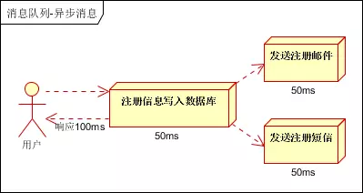
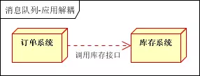
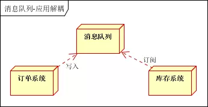
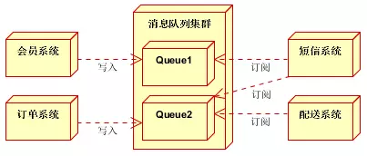
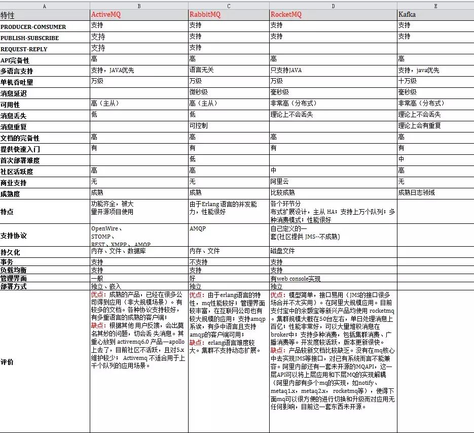

## 消息队列(MQ)

[TOC]

### 概述

消息队列中间件是分布式系统中重要的组件，主要解决应用解耦，异步消息，流量削锋等问题，实现高性能，高可用，可伸缩和最终一致性架构。

目前使用较多的消息队列有ActiveMQ，RabbitMQ，ZeroMQ，Kafka，MetaMQ，RocketMQ。

### 应用场景

以下介绍消息队列在实际应用中常用的使用场景。异步处理，应用解耦，流量削锋和消息通讯四个场景。

#### 异步处理

场景说明：用户注册后，需要发注册邮件和注册短信。传统的做法有两种 1.串行的方式；2.并行方式

- 串行方式：将注册信息写入数据库成功后，发送注册邮件，再发送注册短信。以上三个任务全部完成后，返回给客户端。


- 并行方式：将注册信息写入数据库成功后，发送注册邮件的同时，发送注册短信。以上三个任务完成后，返回给客户端。与串行的差别是，并行的方式可以提高处理的时间



假设三个业务节点每个使用50毫秒钟，不考虑网络等其他开销，则串行方式的时间是150毫秒，并行的时间可能是100毫秒。

因为CPU在单位时间内处理的请求数是一定的，假设CPU1秒内吞吐量是100次。则串行方式1秒内CPU可处理的请求量是7次（1000/150）。并行方式处理的请求量是10次（1000/100）

小结：如以上案例描述，传统的方式系统的性能（并发量，吞吐量，响应时间）会有瓶颈。如何解决这个问题呢？

引入消息队列，将不是必须的业务逻辑，异步处理。改造后的架构如下：


按照以上约定，用户的响应时间相当于是注册信息写入数据库的时间，也就是50毫秒。注册邮件，发送短信写入消息队列后，直接返回，因此写入消息队列的速度很快，基本可以忽略，因此用户的响应时间可能是50毫秒。因此架构改变后，系统的吞吐量提高到每秒20 QPS。比串行提高了3倍，比并行提高了两倍。

#### 应用解耦

场景说明：用户下单后，订单系统需要通知库存系统。传统的做法是，订单系统调用库存系统的接口。如下图：



传统模式的缺点：假如库存系统无法访问，则订单减库存将失败，从而导致订单失败，订单系统与库存系统耦合

如何解决以上问题呢？引入应用消息队列后的方案，如下图：



订单系统：用户下单后，订单系统完成持久化处理，将消息写入消息队列，返回用户订单下单成功

库存系统：订阅下单的消息，采用拉/推的方式，获取下单信息，库存系统根据下单信息，进行库存操作

假如：在下单时库存系统不能正常使用。也不影响正常下单，因为下单后，订单系统写入消息队列就不再关心其他的后续操作了。实现订单系统与库存系统的应用解耦

#### 流量削峰

流量削锋也是消息队列中的常用场景，一般在秒杀或团抢活动中使用广泛。

应用场景：秒杀活动，一般会因为流量过大，导致流量暴增，应用挂掉。为解决这个问题，一般需要在应用前端加入消息队列。

- 可以控制活动的人数

- 可以缓解短时间内高流量压垮应用


用户的请求，服务器接收后，首先写入消息队列。假如消息队列长度超过最大数量，则直接抛弃用户请求或跳转到错误页面。
秒杀业务根据消息队列中的请求信息，再做后续处理

#### 日志处理

日志处理是指将消息队列用在日志处理中，比如Kafka的应用，解决大量日志传输的问题。架构简化如下


```
日志采集客户端，负责日志数据采集，定时写入Kafka队列
Kafka消息队列，负责日志数据的接收，存储和转发
日志处理应用：订阅并消费kafka队列中的日志数据
```

#### 消息通讯

消息通讯是指，消息队列一般都内置了高效的通信机制，因此也可以用在纯的消息通讯。比如实现点对点消息队列，或者聊天室等

- 点对点通讯


客户端A和客户端B使用同一队列，进行消息通讯。

- 聊天室通讯：


客户端A，客户端B，客户端N订阅同一主题，进行消息发布和接收。实现类似聊天室效果。

### 消息中间件示例

#### 电商系统




消息队列采用高可用，可持久化的消息中间件。比如Active MQ，Rabbit MQ，Rocket Mq。

```
- 1）应用将主干逻辑处理完成后，写入消息队列。消息发送是否成功可以开启消息的确认模式。（消息队列返回消息接收成功状态后，应用再返回，这样保障消息的完整性）

- 2）扩展流程（发短信，配送处理）订阅队列消息。采用推或拉的方式获取消息并处理。

- 3）消息将应用解耦的同时，带来了数据一致性问题，可以采用最终一致性方式解决。比如主数据写入数据库，扩展应用根据消息队列，并结合数据库方式实现基于消息队列的后续处理。
```

#### 日志收集系统


分为Zookeeper注册中心，日志收集客户端，Kafka集群和Storm集群（OtherApp）四部分组成。

```
Zookeeper注册中心，提出负载均衡和地址查×××

日志收集客户端，用于采集应用系统的日志，并将数据推送到kafka队列

Kafka集群：接收，路由，存储，转发等消息处理

Storm集群：与OtherApp处于同一级别，采用拉的方式消费队列中的数据
```

### MQ选型对比文档



```
- Kafka是linkedin开源的MQ系统，主要特点是基于Pull的模式来处理消息消费，追求高吞吐量，一开始的目的就是用于日志收集和传输，0.8开始支持复制，不支持事务，适合产生大量数据的互联网服务的数据收集业务。

- RabbitMQ是使用Erlang语言开发的开源消息队列系统，基于AMQP协议来实现。AMQP的主要特征是面向消息、队列、路由（包括点对点和发布/订阅）、可靠性、安全。AMQP协议更多用在企业系统内，对数据一致性、稳定性和可靠性要求很高的场景，对性能和吞吐量的要求还在其次。

- RocketMQ是阿里开源的消息中间件，它是纯Java开发，具有高吞吐量、高可用性、适合大规模分布式系统应用的特点。RocketMQ思路起源于Kafka，但并不是Kafka的一个Copy，它对消息的可靠传输及事务性做了优化，目前在阿里集团被广泛应用于交易、充值、流计算、消息推送、日志流式处理、binglog分发等场景。

- ZeroMQ只是一个网络编程的Pattern库，将常见的网络请求形式（分组管理，链接管理，发布订阅等）模式化、组件化，简而言之socket之上、MQ之下。对于MQ来说，网络传输只是它的一部分，更多需要处理的是消息存储、路由、Broker服务发现和查找、事务、消费模式（ack、重投等）、集群服务等。

```

RabbitMQ/Kafka/ZeroMQ 都能提供消息队列服务，但有很大的区别。

```
在面向服务架构中通过消息代理（比如 RabbitMQ / Kafka等），使用生产者-消费者模式在服务间进行异步通信是一种比较好的思想。

因为服务间依赖由强耦合变成了松耦合。消息代理都会提供持久化机制，在消费者负载高或者掉线的情况下会把消息保存起来，不会丢失。就是说生产者和消费者不需要同时在线，这是传统的请求-应答模式比较难做到的，需要一个中间件来专门做这件事。

其次消息代理可以根据消息本身做简单的路由策略，消费者可以根据这个来做负载均衡，业务分离等。

缺点也有，就是需要额外搭建消息代理集群（但优点是大于缺点的 ） 。

ZeroMQ 和 RabbitMQ/Kafka 不同，它只是一个异步消息库，在套接字的基础上提供了类似于消息代理的机制。使用 ZeroMQ 的话，需要对自己的业务代码进行改造，不利于服务解耦。

RabbitMQ 支持 AMQP（二进制），STOMP（文本），MQTT（二进制），HTTP（里面包装其他协议）等协议。Kafka 使用自己的协议。

Kafka 自身服务和消费者都需要依赖 Zookeeper。

RabbitMQ 在有大量消息堆积的情况下性能会下降，Kafka不会。毕竟AMQP设计的初衷不是用来持久化海量消息的，而Kafka一开始是用来处理海量日志的。
```

```
1、 RabbitMq比kafka成熟，在可用性上，稳定性上，可靠性上，RabbitMq超过kafka

2、 Kafka设计的初衷就是处理日志的，可以看做是一个日志系统，针对性很强，所以它并没有具备一个成熟MQ应该具备的特性

3、 Kafka的性能（吞吐量、tps）比RabbitMq要强
```


