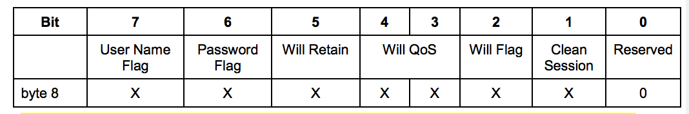

## MQTT协议

### MQTT协议是什么
> MQTT是一个客户端服务端结构的`发布/订阅`模式的消息传输协议。
- 设计思想: 轻巧、开放、简单、规范、易于实现
- 应用场景: 机器与机器的通信(M2M)、物联网环境(IOT)

### MQTT控制报文的结构

MQTT控制报文由三部分组成:

|字段名|描述|
|---|---|
|Fixed header | 固定报头，所有控制报文都包含 |
|Variable header | 可变报头，部分控制报文包含 |
|Payload | 有效载荷，部分控制报文包含 |

#### 固定报头(Fixed header)
> 每个MQTT控制报文都包含一个固定报头。


##### MQTT控制报文的类型(MQTT Control Packet type)

- 位置: Byte1中bits 7-4 ,表示为4位无符号值


##### 标志(Flags)

- 位置: Byte1中bits 3-0

- 在不使用标识位的消息类型中，标识位被作为保留位。如果收到无效的标志时，接收端必须关闭网络连接。


```
- DUP: 发布消息的副本。用来在保证消息的可靠传输，如果设置为1，则在下面的变长中增加MessageId,并且需要回复确认，
以保证消息传输完成，但不能用于检测消息重复发送。

- Qos: 发布消息的服务质量，即: 保证消息传递的次数
     00: 至多一次，即: <= 1
     01: 至少一次，即: >= 1
     10: 只有一次，即: == 1
     11: 预留

- RETAIN: 发布保留标识，表示服务器要保留这次推送的信息，如果有新的订阅者出现，就把这消息推送给它，如果没有，
那么推送至当前订阅者后释放。
```
##### 剩余长度(Remaining Length)

- 位置: 从第二个字节(Byte2)开始

- 剩余长度表示当前报文剩余部分的字节数，包括可变报头和负载的数据。剩余长度不包括用于编码剩余长度字段本身的字节数。

- 剩余长度字段使用一个变长编码方案，对于小于128的值使用单字节编码；更大的值按下面的方式处理:低7位有效位用于编码数据，
最高有效位用于指示是否有更多的字节，且按照大端方式进行编码。因此每个字节可以编码128个数值和一个延续位(continuation bit),
剩余长度字段最大4个字节。

|字节数|最小值|最大值|
|---|---|---|
|1|0(0x00)|127(0x7F)|
|2|128(0x80,0x01)|16383(0xFF,0x7F)|
|3|16384(0x80,0x80,0x01)|2097151(0xFF,0xFF,0x7F)|
|4|2097152(0x80,0x80,0x80,0x01)|268435455(0xFF,0xFF,0xFF,0x7F)|

#### 可变报头
> 某些MQTT控制报文包含一个可变报头部分，它在固定报头和负载之间，可变报头的内容根据报文类型的不同而不同。可变报头的报文标识符(Packet Identifier)字段存在于多个类型的报文中。

##### 报文标识符(Packet Identifier)

|Bit|7-0|
|---|---|
|Byte1| 报文标识符MSB|
|Byte2| 报文标识符LSB|


```
很多类型数据包中都包括一个2字节的数据包标识字段，这些类型的包有: PUBLISH(Qos > 0)、PUBACK、PUBREC、PUBREL、PUBCOMP
、SUBSCRIBE、SUBACK、UNSUBSCRIBE、UNSUBACK

客户端和服务端彼此独立的分配报文标识符，因此，客户端服务端组合使用相同的报文标识符可以实现并发的消息交换。
```

#### 有效载荷(Payload)
> 某些MQTT控制报文在报文的最后部分包含一个有效载荷，对于PUBLISH来说有效载荷就是应用消息。


```
Payload消息体是MQTT数据包的第三部分，包含CONNECT、SUBSCRIBE、SUBACK、UNSUBSCRIBE四中类型的消息:

- CONNECT: 消息体内容主要是: 客户端的ClientID、订阅者的Topic、Message以及用户名和密码

- SUBSCRIBE: 消息体内容是一系列的要订阅的主题以及Qos

- SUBACK: 消息体内容是服务器对于SUBSCRIBE所申请的主题及Qos进行确认和回复

- UNSUBSCRIBE: 消息体内容是要订阅的主题
```

### MQTT控制报文

#### CONNECT-连接服务端
> 客户端到服务端的网络连接建立后，客户端发送给服务端的第一个报文必须是CONNECT报文，在一个网络连接上，客户端只能发送一次CONNECT报文。
> 服务端必须将客户端发送的第二个CONNECT报文当做协议违规处理并断开客户端的连接。
> 有效载荷包含一个或多个编码的字段。包括客户端的唯一标识符，Will主题，Will消息，用户名和密码。除了客户端标识之外，其他的字段都是可选的，
> 基于标志位来决定可变报头中是否需要包含这些字段

##### 固定报头(Fixed header)

- Byte1前四位(报文类型): 0001，后四位(Reserved保留位): 0000

- Byte2...剩余长度:等于可变报头的长度(10字节)加上有效载荷的长度。

##### 可变报头
```
CONNECT报文的可变报头按下列次序包含四个字段:协议名(Protocol Name),协议级别(Protocol Level),连接标志(Connect Flags)和保持连接(Keep Alive)
```

###### 协议名(Protocol Name)
|协议名|说明|内容|
|---|---|---|
|byte1|长度MSB(0)|00000000|
|byte2|长度LSB(4)|00000100|
|byte3|'M'|01001101|
|byte4|'Q'|01010001|
|byte5|'T'|01010100|
|byte6|'T'|01010100|

```
协议名是表示`MQTT`的UTF-8编码的字符串。MQTT规范的后续版本不会改变这个字符串的偏移和长度。
如果协议名不正确，服务端可以断开客户端的连接，也可以按照某些其它规范继续处理CONNECT报文，
对于后一种情况，按照本规范，服务端不能继续处理CONNECT报文。
```

###### 协议级别(Protocol Level)

|协议级别|说明|内容|
|---|---|---|
|byte7|Level(4)|00000100|

```
客户端用8位的无符号值表示协议的修订版本，对于3.1.1版本协议，协议级别字段的值是4(0x04).如果发现不支持的协议级别，服务端必须给客户端发送一个返回码0x01(不支持的协议级别)，
的CONNACK报文响应CONNECT报文，然后断开客户端的连接。
```

###### 连接标志(Connect Flags)
> 连接标志字节包含一些用于指定MQTT连接行为的参数。它还指出有效载荷中的字段是否存在



服务端必须验证CONNECT控制报文的保留标志位(第0位)是否为0，如果不为0必须断开客户端连接。

- 清理会话(Clean Session)

位置： 连接标志字节的第1位,这个二进制位指定了会话状态的处理方式。
```
客户端和服务端可以保存会话状态，以支持跨网络连接的可靠消息传输。这个标志位用于控制会话状态的生存时间。
如果清理会话（CleanSession）标志被设置为0，服务端必须基于当前会话（使用客户端标识符识别）的状态恢复与客户端的通信。
如果没有与这个客户端标识符关联的会话，服务端必须创建一个新的会话，当连接断开后，客户端和服务端必须保存会话信息。
当清理会话标志为0的会话连接断开之后，服务端必须将之后的QoS 1和QoS 2级别的消息保存为会话状态的一部分，如果这
些消息匹配断开连接时客户端的任何订阅。服务端也可以保存满足相同条件的QoS 0级别的消息。

如果清理会话（CleanSession）标志被设置为1，客户端和服务端必须丢弃之前的任何会话并开始一个新的会话。
会话仅持续和网络连接同样长的时间。与这个会话关联的状态数据不能被任何之后的会话重用。
```

客户端的会话状态包括:
```
- 已经发送给服务端，但是还没有完成确认的QoS 1和QoS 2级别的消息

- 已从服务端接收，但是还没有完成确认的QoS 2级别的消息
```

服务端的会话状态包括:
```
- 会话是否存在，即使会话状态的其它部分都是空

- 客户端的订阅信息

- 已经发送给客户端，但是还没有完成确认的QoS 1和QoS 2级别的消息

- 即将传输给客户端的QoS 1和QoS 2级别的消息

- 已从客户端接收，但是还没有完成确认的QoS 2级别的消息

- 可选，准备发送给客户端的QoS 0级别的消息
```

```
保留消息不是服务端会话状态的一部分，会话终止时不能删除保留消息

当清理会话标志被设置为1时，客户端和服务端的状态删除不需要是原子操作
```

- 遗嘱标志(Will Flag)

位置: 连接标志的第2位

```
遗嘱标志（Will Flag）被设置为1，表示如果连接请求被接受了，遗嘱（Will Message）消息必须被存储在服务端并且与这个网络连接关联。
之后网络连接关闭时，服务端必须发布这个遗嘱消息，除非服务端收到DISCONNECT报文时删除了这个遗嘱消息
```

遗嘱消息的发布条件,包括但不限于:
```
- 服务端检测到了一个I/O错误或者网络故障

- 客户端在保持连接（Keep Alive）的时间内未能通讯

- 客户端没有先发送DISCONNECT报文直接关闭了网络连接

- 由于协议错误服务端关闭了网络连接

如果遗嘱标志被设置为1，连接标志中的Will QoS和Will Retain字段会被服务端用到，同时有效载荷中必须包含Will Topic和Will Message字段。

一旦被发布或者服务端收到了客户端发送的DISCONNECT报文，遗嘱消息就必须从存储的会话状态中移除。

如果遗嘱标志被设置为0，连接标志中的Will QoS和Will Retain字段必须设置为0，并且有效载荷中不能包含Will Topic和Will Message字段。

如果遗嘱标志被设置为0，网络连接断开时，不能发送遗嘱消息。
```

- 遗嘱Qos(Will Qos)

位置: 连接标志的第4位和第3位

```
这两位用于指定发布遗嘱消息时使用的服务质量等级。
如果遗嘱标志被设置为0，遗嘱QoS也必须设置为0(0x00)。
如果遗嘱标志被设置为1，遗嘱QoS的值可以等于0(0x00)，1(0x01)，2(0x02)。它的值不能等于3。
```

- 遗嘱保留(Will Retain)

位置: 连接标志的第5位
```
如果遗嘱消息被发布时需要保留，需要指定这一位的值。
如果遗嘱标志被设置为0，遗嘱保留（Will Retain）标志也必须设置为0。
如果遗嘱标志被设置为1：

- 如果遗嘱保留被设置为0，服务端必须将遗嘱消息当作非保留消息发布。

- 如果遗嘱保留被设置为1，服务端必须将遗嘱消息当作保留消息发布。
```

- 用户名标志(User Name Flag)

位置: 连接标志的第7位
```
- 如果用户名（User Name）标志被设置为0，有效载荷中不能包含用户名字段

- 如果用户名（User Name）标志被设置为1，有效载荷中必须包含用户名字段
```

- 密码标志(Password Flag)

位置: 连接标志的第6位
```
- 如果密码（Password）标志被设置为0，有效载荷中不能包含密码字段

- 如果密码（Password）标志被设置为1，有效载荷中必须包含密码字段

- 如果用户名标志被设置为0，密码标志也必须设置为0
```

###### 保持连接(Keep Alive)

|Bit|说明|内容|
|---|---|---|
|Byte9|保持连接 Keep Alive MSB||
|Byte10|保持连接 Keep Alive LSB||

```
保持连接（Keep Alive）是一个以秒为单位的时间间隔，表示为一个16位的字，它是指在客户端传输完成一个控制报文的时刻到发送下一个报文的时刻，
两者之间允许空闲的最大时间间隔。客户端负责保证控制报文发送的时间间隔不超过保持连接的值。如果没有任何其它的控制报文可以发送，客户端必须发送一个PINGREQ报文

不管保持连接的值是多少，客户端任何时候都可以发送PINGREQ报文，并且使用PINGRESP报文判断网络和服务端的活动状态

如果保持连接的值非零，并且服务端在一点五倍的保持连接时间内没有收到客户端的控制报文，它必须断开客户端的网络连接，认为网络连接已断开

客户端发送了PINGREQ报文之后，如果在合理的时间内仍没有收到PINGRESP报文，它应该关闭到服务端的网络连接。

保持连接的值为零表示关闭保持连接功能。这意味着，服务端不需要因为客户端不活跃而断开连接。注意：不管保持连接的值是多少，任何时候，只要服务端
认为客户端是不活跃或无响应的，可以断开客户端的连接。
```

##### 可变报头非规范示例


#### 有效载荷(Payload)
```
CONNECT报文的有效载荷（payload）包含一个或多个以长度为前缀的字段，可变报头中的标志决定是否包含这些字段。如果包含的话，
必须按这个顺序出现：客户端标识符，遗嘱主题，遗嘱消息，用户名，密码
```

##### 客户端标识符(Client Identified)
```
服务端使用客户端标识符 (ClientId) 识别客户端。连接服务端的每个客户端都有唯一的客户端标识符（ClientId）。

客户端和服务端都必须使用ClientId识别两者之间的MQTT会话相关的状态。

客户端标识符 (ClientId) 必须存在而且必须是CONNECT报文有效载荷的第一个字段。

客户端标识符必须是上面定义的UTF-8编码字符串。

服务端必须允许1到23个字节长的UTF-8编码的客户端标识符，客户端标识符只能包含这些字符：“0123456789abcdefghijklmnopqrstuvwxyzABCDEFGHIJKLMNOPQRSTUVWXYZ”（大写字母，小写字母和数字）。

服务端可以允许编码后超过23个字节的客户端标识符 (ClientId)。服务端可以允许包含不是上面列表字符的客户端标识符 (ClientId)。

服务端可以允许客户端提供一个零字节的客户端标识符 (ClientId) ，如果这样做了，服务端必须将这看作特殊情况并分配唯一的客户端标识符给那个客户端。然后它必须假设客户端提供了那个唯一的客户端标识符，正常处理这个CONNECT报文。

如果客户端提供了一个零字节的客户端标识符，它必须同时将清理会话标志设置为1。

如果客户端提供的ClientId为零字节且清理会话标志为0，服务端必须发送返回码为0x02（表示标识符不合格）的CONNACK报文响应客户端的CONNECT报文，然后关闭网络连接。

如果服务端拒绝了这个ClientId，它必须发送返回码为0x02（表示标识符不合格）的CONNACK报文响应客户端的CONNECT报文，然后关闭网络连接。
```

##### 遗嘱主题(Will Topic)
```
如果遗嘱标志被设置为1，有效载荷的下一个字段是遗嘱主题（Will Topic）。
```

##### 遗嘱消息(Will Message)
```
如果遗嘱标志被设置为1，有效载荷的下一个字段是遗嘱消息。遗嘱消息定义了将被发布到遗嘱主题的应用消息。

这个字段由一个两字节的长度和遗嘱消息的有效载荷组成，表示为零字节或多个字节序列。长度给出了跟在后面的数据的字节数，不包含长度字段本身占用的两个字节

遗嘱消息被发布到遗嘱主题时，它的有效载荷只包含这个字段的数据部分，不包含开头的两个长度字节。
```

##### 用户名(User Name)
```
如果用户名（User Name）标志被设置为1，有效载荷的下一个字段就是它。服务端可以将它用于身份验证和授权。
```

##### 密码(Password)
```
如果密码（Password）标志被设置为1，有效载荷的下一个字段就是它。密码字段包含一个两字节的长度字段，长度表示二进制数据的字节数（不包含长度字段本身占用的两个字节），后面跟着0到65535字节的二进制数据。
```
密码字节
|Bit|7-0|
|---|---|
|byte1|数据长度MSB|
|byte2|数据长度LSB|
|byte3...|如果数据长度大于0，这里就是数据部分|

### 响应Response

***注意***: 服务器可以在同一个TCP端口或其他网络端点上支持多种协议（包括本协议的早期版本）。如果服务器确定协议是MQTT 3.1.1，那么它按照下面的方法验证连接请求
```
- 1、网络连接建立后，如果服务端在合理的时间内没有收到CONNECT报文，服务端应该关闭这个连接。

- 2、服务端必须按照 上文 的要求验证CONNECT报文，如果报文不符合规范，服务端不发送CONNACK报文直接关闭网络连接

- 3、服务端可以检查CONNECT报文的内容是不是满足任何进一步的限制，可以执行身份验证和授权检查。如果任何一项检查没通过，
它应该发送一个适当的、返回码非零的CONNACK响应，并且必须关闭这个网络连接。
```

如果验证成功，服务端会执行下列步骤：
```
- 1、如果ClientId表明客户端已经连接到这个服务端，那么服务端必须断开原有的客户端连接。

- 2、服务端必须按照 上文 的描述执行清理会话的过程。

- 3、服务端必须发送返回码为零的CONNACK报文作为CONNECT报文的确认响应。

- 4、开始消息分发和保持连接状态监视
```

允许客户端在发送CONNECT报文之后立即发送其它的控制报文；客户端不需要等待服务端的CONNACK报文。如果服务端拒绝了CONNECT，它不能处理客户端在CONNECT报文之后发送的任何数据。