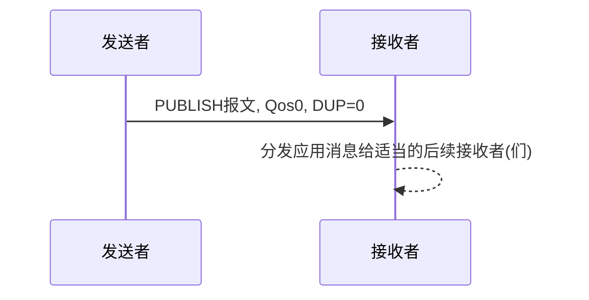
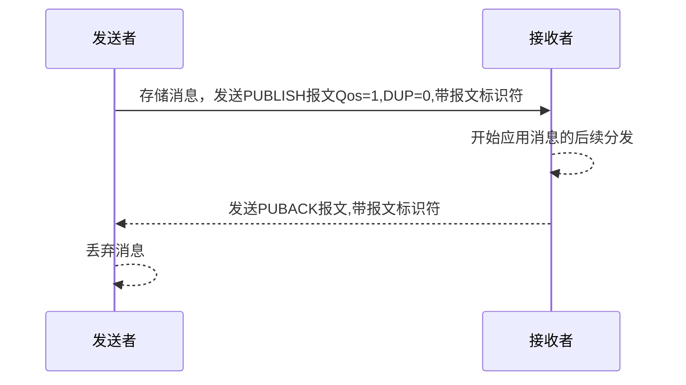
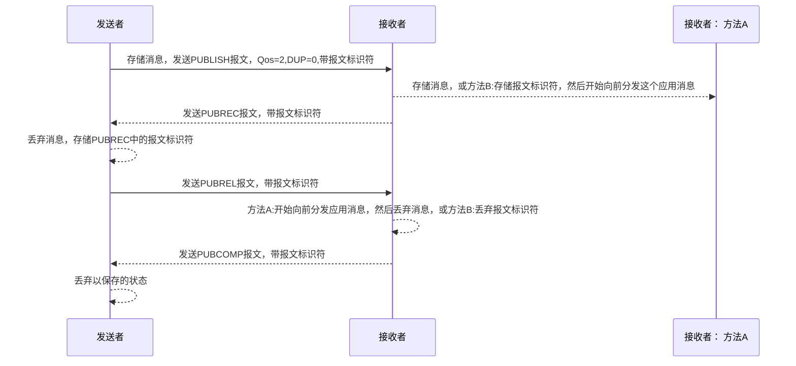

## MQTT操作行为

### 状态存储

为了提供服务质量保证，客户端和服务端有必要存储会话状态，会话必须至少持续和它的活动网络连接同样长的时间。

服务端的保留消息不是会话状态的组成部分。服务端应该保留那种消息直到客户端删除它

### 网络连接

MQTT协议要求基础传输层能够提供有序的、可靠的、双向传输（从客户端到服务端 和从服务端到客户端）的字节流

MQTT3.1使用的传输层协议是TCP/IP协议，也支持TLS协议和WebSocket协议

无连接的网络传输协议如UDP是不支持的，因为他们可能会丢失数据包或对数据包重排序


### 服务质量等级和协议流程Qos

MQTT按照这里定义的服务质量 (QoS) 等级分发应用消息。分发协议是对称的，在下面的描述中，客户端和服务端既
可以是发送者也可以是接收者。分发协议关注的是从单个发送者到单个接收者的应用消息。服务端分发应用消息给多个
客户端时，每个客户端独立处理。分发给客户端的出站应用消息和入站应用消息的QoS等级可能是不同的。

#### Qos 0: 最多分发一次

消息的分发依赖于底层网络的能力。接收者不会发送响应，发送者也不会重试。消息可能送达一次也可能根本没送达

- 对于Qos 0 的分发协议，发送者:

必须发送QoS等于0，DUP等于0的PUBLISH报文

- 对于Qos 0 的分发协议,接收者:

接受PUBLISH报文时同时接受消息的所有权

- 流程图:



#### Qos 1: 至少分发一次

服务质量确保消息至少送达一次。QoS 1的PUBLISH报文的可变报头中包含一个报文标识符，需要PUBACK报文确认

对于Qos1的分发协议,发送者:
```
- 每次发送新的应用消息都必须分配一个未使用的报文标识符。

- 发送的PUBLISH报文必须包含报文标识符且QoS等于1，DUP等于0。

- 必须将这个PUBLISH报文看作是 未确认的 ，直到从接收者那收到对应的PUBACK报文。
```

**注意**: 允许发送者在等待确认时使用不同的报文标识符发送后续的PUBLISH报文。

对于Qos1的分发协议,接收者:
```
- 响应的PUBACK报文必须包含一个报文标识符，这个标识符来自接收到的、已经接受所有权的PUBLISH报文

- 发送了PUBACK报文之后，接收者必须将任何包含相同报文标识符的入站PUBLISH报文当作一个新的消息，并忽略它的DUP标志的值
```

- 流程图:



#### Qos 2: 仅分发一次

这是最高等级的服务质量，消息丢失和重复都是不可接受的。使用这个服务质量等级会有额外的开销,
QoS 2的消息可变报头中有报文标识符,QoS 2的PUBLISH报文的接收者使用一个两步确认过程来确认收到。

- 对于Qos 2的分发协议,发送者:
```
- 必须给要发送的新应用消息分配一个未使用的报文标识符

- 发送的PUBLISH报文必须包含报文标识符且报文的QoS等于2,，DUP等于0

- 必须将这个PUBLISH报文看作是 未确认的 ，直到从接收者那收到对应的PUBREC报文。

- 收到PUBREC报文后必须发送一个PUBREL报文。PUBREL报文必须包含与原始PUBLISH报文相同的报文标识符。

- 必须将这个PUBREL报文看作是 未确认的 ，直到从接收者那收到对应的PUBCOMP报文。

- 一旦发送了对应的PUBREL报文就不能重发这个PUBLISH报文。
```

**注意**：允许发送者在等待确认时使用不同的报文标识符发送后续的PUBLISH报文。

- 对于Qos 2的分发协议,接收者:
```
- 响应的PUBREC报文必须包含报文标识符，这个标识符来自接收到的、已经接受所有权的PUBLISH报文。

- 在收到对应的PUBREL报文之前，接收者必须发送PUBREC报文确认任何后续的具有相同标识符的PUBLISH报文。 在这种情况下，它不能重复分发消息给任何后续的接收者

- 响应PUBREL报文的PUBCOMP报文必须包含与PUBREL报文相同的标识符。

- 发送PUBCOMP报文之后，接收者必须将包含相同报文标识符的任何后续PUBLISH报文当作一个新的发布
```

- 流程图:



### 消息分发重试

客户端设置清理会话（CleanSession）标志为0重连时，客户端和服务端必须使用原始的报文标识符重发任何未确认的PUBLISH报文（如果QoS>0）和PUBREL报文。
这是唯一要求客户端或服务端重发消息的情况。
