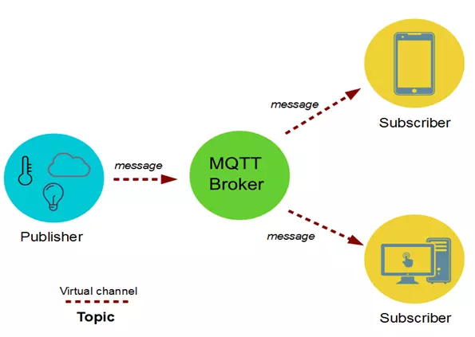

[TOC]

# MQTT

**相关链接**

[官网链接](http://mqtt.org//)

[git仓库链接](https://github.com/mqtt)

## 什么是MQTT

MQTT是Message Queuing Telemetry Transport的缩写，它是一个基于发布/订阅模式的轻量级消息中间件协议，该协议构建于TCP/IP协议上。
MQTT最初由IBM于上世纪90年代晚期发明和开发，它最初的用途是将石油管道上的传感器与卫星相连接。顾名思义，它是一种支持在各方之间异步通信的消息协议。
异步消息协议在空间和时间上将消息发送者与接收者分离，因此可以在不可靠的网络环境中进行扩展。虽然叫做消息队列遥测传输，但它与消息队列毫无关系，而是
使用了一个发布/订阅的模型。


## 为什么要用MQTT

- 轻量级

协议简单，容易实现，并且具有很快的传输速度。

- 低协议开销

MQTT的每个消息标题可以短至2个字节，包含数据类型和一些辅助信息字段，传输效率高，占用带宽少。对于HTTP,为每个新请求消息重新建立HTTP连接，会导致重大的开销。MQTT所使用的永久连接显著减少了这一开销。

- 可靠

MQTT协议中定义了消息传输的Qos,可以保证消息的可靠传输。即使在网络环境恶劣的情况下(如设备进入地铁、隧道等无信号区域)，也能保证消息不丢失。

- 低功耗

MQTT是专门针对低功耗目标而设计的，降低了对设备的硬件要求，不需要很好的CPU，不需要很大的内存，同时省电，这使得MQTT可以运行在大多数的物联网设备上。

- 实时

MQTT基于TCP/IP进行数据传输，消息传输延迟低。

- 推送通知

MQTT采用订阅/发布模式，为推送而生。

## 发布和订阅模型

MQTT协议在网络中定义了两种实体类型: 一个消息代理和一些客户端。代理是一个服务器，它从客户端接收所有消息，然后将这些消息路由到相关的目标客户端。客户端是能够与代理交互来发送和接收消息的任何事物。
客户端可以先现场的IoT传感器，或者是数据中心内处理IoT数据的应用程序。

- 1.客户端连接到代理。它可以订阅代理中的任何消息"主题"。此连接可以是简单的TCP/IP连接，也可以是用于发送敏感消息的加密TLS连接。

- 2.客户端通过将消息和主题发送给代理，发布某个主题范围内的消息。

- 3.代理然后将消息转发给所有订阅该主题的客户端。

```
因为MQTT消息是按主题进行组织的，所以应用程序开发人员能灵活地指定某些客户端只能与某些消息交互。例如,传感器将在"sensor_data"主题范围内发布读数，并订阅"config_change"主题。将传感器数据保存到后端数据库中的
数据处理应用程序会订阅"sensor_data"主题。管理控制台应用程序能接收系统管理员的命令来调整传感器的配置，比如灵敏度和采样频率，并将这些更改发布到"config_change"主题
```


同时，MQTT是轻量级的。它有一个用来指定消息类型的简单标头，有一个基于文本的主题，还有一个任意的二进制有效负载。应用程序可对有效负载采用任何数据格式，比如JSON、XML、加密二进制或Base64，只要目标客户端能够解析
该有效负载。

## MQTT核心概念

MQTT通过以下方式进行数据交互:



客户端Publisher发送一条消息message给MQTT Broker，发送消息时需要关联一个topic和Qos(Quality of Service)。topic指定了消息要发送给哪个主题，Qos指定了消息可靠性等级。
假设当前消息发送给主题topic1，并且有两个客户端Subscriber分别订阅了topic1。MQTT Broker收到消息后，发现消息是发送给topic1的，于是将这份消息分别转发给它的两个订阅者。

MQTT的核心概念包括:

- **Broker**: 又称Server，是MQTT的服务端，负责与客户端建立连接，接收并转发消息，接收订阅和取消订阅请求等。

- **Clinet**: 使用MQTT协议的程序或设备，负责与Broker建立连接，发送或者接收数据，订阅主题或者取消订阅。

- **Message**: 在MQTT协议中传输的数据，当消息被传输时，通常和一个主题名称(topic name)以及一个Qos(服务质量)关联起来。

- **Topic**: 主题有两层含义，在发布消息时，主题会和消息关联起来，告诉Broker这条消息要发给哪个主题。在订阅消息时，客户端需要告诉Broker自己对哪个主题感兴趣，一旦有消息发给这个主题，Broker会将消息发给主题的订阅者。
主题支持通配符，对于使用通配符的主题，我们称为Topic Filter。

- **Publish**: 客户端发送消息给Broker的过程。发送消息时需要指定topic和Qos。Broker会将消息转发给订阅了该topic的其他客户端。

- **Subscribe**: 客户端订阅主题的过程。客户端告诉Broker,自己对某个topic感兴趣，当有其他客户端发送消息给这个topic时，Broker会转发该消息给自己。客户端可以取消订阅，这个过程称作Unsubscribe,取消订阅后，Broker
不会再转发消息给当前客户端。

- **Qos**: Quality of Service 消息可靠性传递的参数，有3个值，分别是:
```
- 0, 消息只发送一次，不保证发送成功。

- 1，消息最少发送一次，保证发送成功。因为可能发送多次，因此接收方可能收到重复消息。

- 2，消息只发送一次，保证成功。接收方不会接到重复消息。
```

发送消息时，可以指定Qos，如果Qos>0，那么消息一定会发到Broker。订阅主题时，也可以指定Qos，如果Qos>0，那么Broker一定会将消息发给订阅者，不会丢失。这里需要注意，消息从发布者到订阅者，是分两步走的，第一步由发布者发布到
MQTT Broker，第二步是MQTT Broker转发消息到订阅者。所以只有当发布消息时，指定Qos>0，并且订阅主题时，Qos>0，消息才能可靠的从发布客户端发送到订阅客户端。

## MQTT协议版本

MQTT协议有两个主要的版本，MQTT3和MQTT5，MQTT3是当前主要使用的协议版本，大多数MQTT实现都支持该版本。


## MQTT安全

- 如何使用MQTT发送1-1消息?

双方可以协商使用一个特定于它们的主题。例如,主题名称可以包含两个客户端的ID，以确保它的唯一性。

但是假设设备B和设备C发送同一主题的情况下，设备A无法知道是设备B还是设备C发送的消息，也有可能消息被设备D窃听。

- 如何保护通信？

客户端与代理的连接可以采用TLS加密连接，以保护传输中的数据。此外，因为MQTT协议对有效负载数据格式没有任何限制，所以系统可以协商一种加密方法和密钥更新机制。在这之后，有效负载中的所有内容可以是实际JSON或XML消息的加密二进制数据。


## 示例


