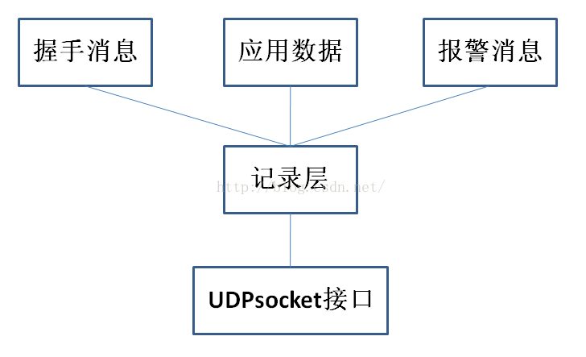
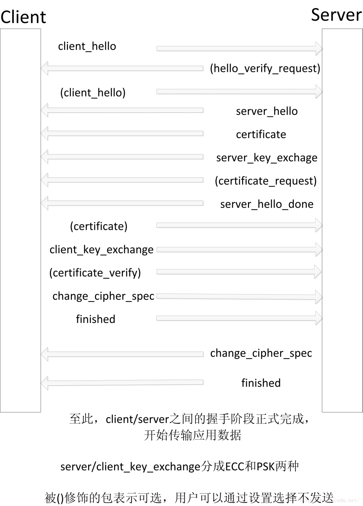

## DTLS协议

[TOC]

### 介绍

#### 作用

互联网先驱们最开始在设计互联网协议时主要考虑的是可用性，安全性是没有考虑在其中的，所以传输层的TCP、UDP协议本身都不具备安全性。

SSL/TLS协议是基于TCP socket，在传输层和应用层之间构建了一个端到端的安全通道，保证了传输数据的加密性。

但是SSL/TLS协议并不能用于UDP协议，而UDP也有安全传输的需求，于是产生了DTLS协议（Datagram TLS）。

即DTLS的作用为给UDP提供端到端的安全通道，就像SSL/TLS对TCP的作用一样。并且DTLS尽可能参考了SSL/TLS协议的安全机制，在具体实现上复用了70%的TLS代码。

#### 特点

UDP协议是不面向连接的不可靠协议，且没有对传输的报文段进行加密，不能保证通信双方的身份认证、消息传输过程中的按序接收、不丢失和加密传送。

而DTLS协议在UDP提供的socket之上实现了客户机与服务器双方的握手连接，并且在握手过程中通过使用PSK或ECC实现了加密，并且利用cookie验证机制和证书实现了通信双方的身份认证，并且用在报文段头部加上序号，缓存乱序到达的报文段和重传机制实现了可靠传送。

在握手完成后，通信双方就可以实现应用数据的安全加密和可靠传输。

#### 层次

DLTS协议分为两层，下层为记录层（记录层），record包的内容分为头部和载荷两部分。记录包的载荷即为上层的内容。DTLS上层的包的类型分为三种，分别是握手消息，警告消息，应用数据；如图一所示。



在整个DTLS协议的通信过程中，通信双方构造报文段的过程都是先产生上层的载荷消息（如握手消息，应用数据，警告消息），然后添加头部，构成完整的上层消息。接着再以此作为记录层的载荷，最后添加记录层的头部，构成完整的记录报文段，最后调用UDP的socket接口，发送给另一方。

加密过程是只对记录层的载荷(即上层消息，此协议中被加密的消息是finished消息和应用数据两种)进行加密，所以接收方在收到记录消息后，首先要做的也是判断记录消息是否被发送方加密，若是，则应先解密才能读取出明文数据以进行后面的处理。

### dtls传输阶段

#### 握手阶段的交互过程

DTLS的传输阶段分为两个：握手阶段和握手建立之后的传输应用数据阶段。



客户机向服务器发起连接，服务器可以根据配置选择是否验证客户机的cookie和证书（即是否向客户机发送client_hello_verify和certificate_request报文段）。

#### dtls的cookie验证机制

由于DTLS是基于UDP的，所以可能会遭受两种形式的拒绝服务攻击。一种是类似于对TCP的资源消耗攻击，另一种是放大攻击，即恶意攻击者仿造被攻击者的IP地址发通信初始化报文段给服务器，而服务器会返回一个体积大很多的证书给被攻击者，超大量证书有可能造成被攻击者的瘫痪。

cookie机制要求客户机重复发送服务器之前发送的cookie值来验证通信方的源IP地址确实可以通信，由此可以减少拒绝服务攻击的危害。

cookie验证身份的具体机制为：

```
协议规定客户机发送的第一个报文段client_hello中含有cookie的值这一项（有可能为空）。服务器检验收到的该报文段中的cookie值，如果cookie为空，则说明之前没建立过连接，
服务器根据客户机的源IP地址通过哈希方法随机生成一个cookie，并填入client_hello_verify中发送给客户机。

客户机再在第二次发送的client_hello报文段中填入服务器之前发过来的cookie，服务器第二次收到该报文段之后便检验报文段里面的cookie值和服务器之前发给该主机的cookie值是否完全相同，
若是，则通过cookie验证，继续进行握手连接；若不是，则拒绝建立连接。
```

#### client_hello报文段和server_hello报文段的内容

client_hello报文段的内容除cookie外，还有客户机产生的32字节的随机数，其中前4字节为时间戳，后28字节为系统产生的随机数。
此外，该报文段的内容还有客户机支持的加密方式（PSK或者ECC）和压缩方式，供服务器进行选择。

在通过cookie校验后，服务器发送server_hello报文段给客户机。该报文段包含有服务器产生的32字节的随机数，和服务器选中的用来进行之后的会话的加密方式和压缩方式。

#### certificate报文段的内容

在服务器发给客户机的证书报文段中，包含有服务器证书的公钥；客户机接收到该报文段后，按照协议规定，从报文段的对应位置中读取出服务器证书的公钥存入相关变量中。

#### 基于ECC加密方式的ECDH秘钥交换协议和ECDSA数字签名算法

若协议所选加密方式为ECC（椭圆曲线加密），则在server_key_exchange报文段的构造过程中会使用ECDH（椭圆曲线秘钥交换协议）和ECDSA（椭圆曲线数字签名算法）。
ECDH和ECDSA分别是ECC和DH（diffie-hellman）秘钥交换协议、DSA（数字签名算法）的结合。

在server_key_exchange报文段中，包含有所选用的椭圆曲线E，阶N和基点G的x,y坐标，客户机在收到这个报文段后，进行对应的格式检验，并读取数据，
因此服务器和客户机共同获得约定好的用来进行ECDH秘钥协商交换协议的参数，从而可以共同协商出相同的对话秘钥用于加密之后的会话内容。

同时，为了防范中间人攻击，服务器还在server_key_exchange报文段的末尾对整个报文段进行了ECDSA数字签名。具体签名过程为先用client_hello报文段和server_hello报文段中的2个32字节的随机数作为函数参数，
利用sha256哈希算法对server_key_exchange报文段本身的载荷产生摘要，然后再用服务器的私钥和sha256哈希算法进行ECDSA数字签名，得到签名结果r和s,并写入server_key_exchange报文段的末尾。

客户机在收到server_key_exchange报文段后，先进行各数值项格式的校验，然后提取出报文段末尾的签名值r和s。之后，用已经读取出的服务器的公钥的x,y坐标值来对server_key_exchange报文段进行ECDSA签名验证，若结果和报文段中的r和s值一致，则报文段通过验证。

#### 基于PSK加密方式的身份认证过程和会话秘钥产生过程

整个DTLS协议的加密方式可选用ECC或PSK（预共享秘钥，PreSharedKey）两种。若为ECC，则通过ECDH协议来进行通信双方的秘钥协商；若为PSK，则直接以通信双方事先就已经约定好了的秘钥为基础来进行加密通信。

对于PSK加密通信来说，验证对方的通信身份非常关键。所以通信双方会在本地存取对方的psk_id（即身份标志）和psk_id_length（身份标志长度），通过比较收到的报文段中的psk_id,psk_id_length和本地存储的是否完全一致来进行对方身份的验证。

在整个通信过程中，采用PSK与ECC的区别主要体现在server_key_exchange报文段、client_key_exchange报文段的内容不同和双方计算得到预主秘钥方式的不同。

当采用PSK加密时，server_key_exchange报文段和client_key_exchange报文段的内容分别是服务器与客户机各自的psk_id和psk_id_length，由此双方可以互相知道对方的psk_id和psk_id_length。

之后，双方都会对收到的报文段进行检验，只有psk_id和psk_id_length与本地存储的完全一致才会进行后面的通信。

当双方都通过身份验证后，双方再各自用相同的函数产生预主秘钥，而函数的参数包括之前通信阶段中双方各自产生的32字节的随机数，由此可以保证虽然本地存储的psk秘钥不变，但每次临时通信时的会话秘钥还是会一直变化的，从而增强了抗攻击性。

双方产生预主秘钥后，再调用和使用ECC加密的相同方式来产生主秘钥，即用于之后会话通信的对称秘钥，该过程中依然会用到双方产生的32字节的随机数。

由此，通信双方使用PSK加密方式来实现了身份认证和会话秘钥的产生。

#### server_hello_done报文段和client_key_exchange报文段的内容

服务器发送的server_hello_done报文段的载荷部分为空，只是发给客户机来作为标志，表示服务器当前阶段的报文段已经发送完毕。

客户机在收到server_hello_done报文段后，发送client_key_exchange报文段给服务器，里面包含了用于秘钥协商的基点的x,y坐标,并且不同于server_key_exchange报文段，客户机并没有在报文段的末尾进行ECDSA数字签名。

#### 客户机产生会话秘钥

之后，客户机再通过ecdh_pre_master_secret函数来产生用于之后会话的预主秘钥。其中函数的参数包括客户机自己的私钥，和服务器共享的用于ECDH秘钥协商算法的基点的x,y坐标。

产生预主秘钥后，再根据之前阶段客户机和服务器分别产生的32字节的随机数产生主秘钥master_secret，此时主秘钥为对称秘钥，用于之后会话的加解密。

#### change_cipher_spec报文段和finished报文段的内容

客户机计算出会话秘钥后，发送change_cipher_spec报文段给服务器，这个报文段的有效载荷为空，用来作为标志通知服务器，表示客户机已经算出主秘钥，之后发送的报文段会采用主秘钥加密。

握手阶段中客户机发送的最后一个报文段为finished报文段，载荷内容为MAC值（消息验证码），用于给服务器做认证。并且值得注意的是，finished报文段作为记录层的载荷部分在发送时已经用上一步产生的会话秘钥进行加密编码。

#### 服务器产生会话秘钥

服务器在收到客户机发送过来的finished报文段后，也会和客户机用ECDH秘钥协商算法经过相同的流程，调用相同的函数先产生预主秘钥，再产生主秘钥。

#### 握手阶段的结束

最后，服务器产生经会话秘钥加密后的finished报文段给客户机，标志整个握手阶段的结束。

客户机收到服务器发过来的finished报文段后，便可发送应用数据。并且应用数据会一直用会话秘钥加密，从而实现了UDP所不具备的安全性。